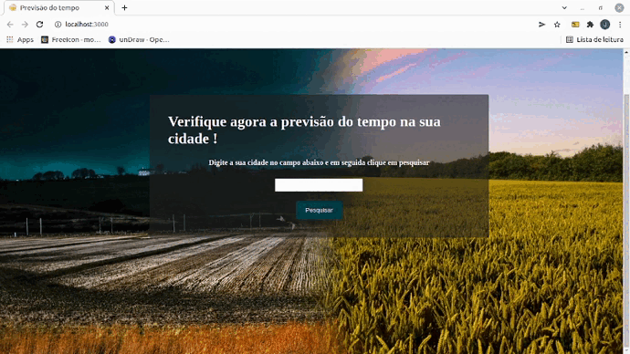

<h1>Previsão do tempo</h1>

<h4>Projeto no qual o usuário digita o nome da cidade ,e ele retorna a previsão do tempo ,região e a temperatura da cidade .Caso o usuário digite uma cidade que não exite retorna um erro . </h4>
<h5>Foi usado a API :http://api.weatherapi.com/v1/current.json?key=b60f38e95f5b496f97c163757212210&q=${city}&lang=pt</h5>

